# CareerFit

<p align="center">
  <strong>AI-Powered, Explainable Resume-to-Job Matching</strong>
</p>

<p align="center">
  Understand your career fit. Discover skill gaps. Prepare with confidence.
</p>

<p align="center">
  
  
  
  
  
  
</p>

---

## Overview

CareerFit is a full-stack application that analyzes how well a candidate's resume aligns with a specific job description.

It combines AI-powered extraction, semantic skill matching, and deterministic scoring to generate an explainable resume-to-job fit report.

Instead of providing only a score, CareerFit helps users understand:

* How closely their resume matches a target role.
* Which skills and qualifications are well supported.
* Which requirements are partially matched or missing.
* What evidence from the resume supports each assessment.
* How to improve their resume.
* What topics to prepare for interviews.

> CareerFit is designed to make resume evaluation more transparent, actionable, and personalized.

---

## Features

<details>
<summary><strong>Authentication & Account Management</strong></summary>

* Email/password authentication using Supabase Auth.
* Protected application routes with AuthGuard.
* JWT bearer-token authentication between frontend and backend.
* User-scoped access to resumes and job descriptions.

</details>

<details>
<summary><strong>Resume Management</strong></summary>

* Upload PDF resumes.
* Extract text from uploaded documents.
* Store files in a private Supabase Storage bucket.
* Create, view, and delete saved resumes.
* Maximum of 5 resumes per user.
* Automatically delete the oldest resume when the limit is exceeded.

</details>

<details>
<summary><strong>Job Description Management</strong></summary>

* Save job descriptions.
* Store job title, company, and raw description.
* Create, view, and delete saved jobs.
* Maximum of 5 jobs per user.
* Automatically delete the oldest job when the limit is exceeded.

</details>

<details>
<summary><strong>Explainable AI Analysis</strong></summary>

CareerFit generates a structured report containing:

* Overall fit score.
* Category-level score breakdown.
* Skill matches and partial matches.
* Missing or undetected skills.
* Requirement-level analysis.
* Resume evidence for detected requirements.
* Requirement importance.
* Candidate strengths and gaps.
* Resume improvement suggestions.
* Interview preparation topics.

</details>

<details>
<summary><strong>Semantic Skill Matching</strong></summary>

The deterministic matching engine supports:

* Skill normalization.
* Semantic similarity matching.
* Weighted scoring.
* Matching related skills beyond exact keywords.
* Automated backend tests.

Matching engine location:

`backend/services/matching/`

</details>

---

## How It Works

CareerFit follows a multi-stage pipeline that combines document understanding, semantic matching, and explainable scoring.

```text
                  RESUME PDF
                      |
                      v
               PDF Text Extraction
                      |
                      v
            Resume Information Extraction
                      |
                      v
             Structured Resume Profile
                      |
                      |
               JOB DESCRIPTION
                      |
                      v
            Job Requirement Extraction
                      |
                      v
             Requirement Classification
                      |
                      v
          Required / Preferred Requirements
                      |
                      v
             Semantic Skill Matching
                      |
                      v
          Requirement-Level Evaluation
                      |
                      v
               Weighted Scoring
                      |
                      v
             Explainable Analysis
                      |
                      v
               Recommendations
                      |
                      v
             FINAL ANALYSIS REPORT
```

The analysis combines LLM-based understanding with deterministic semantic matching and scoring.

---

## Analysis Report

CareerFit is designed to provide more than a keyword match.

### Overall Fit

A high-level assessment of how closely the candidate's resume aligns with the selected role.

### Score Breakdown

The overall assessment can be analyzed across categories such as:

* Skills.
* Experience.
* Tools and Technologies.
* Education.
* Responsibilities.

### Skill Matching

Skills are classified into different levels:

| Classification | Meaning                                |
| :------------- | :------------------------------------- |
| Strong Match   | Strong evidence of the required skill. |
| Match          | Relevant skill alignment.              |
| Partial Match  | Related or incomplete skill alignment. |
| Weak Evidence  | Limited supporting evidence.           |
| Not Detected   | Skill not identified in the resume.    |

### Requirement-Level Analysis

Each important job requirement is compared against evidence found in the resume.

```text
Job Requirement
      |
      v
Resume Evidence
      |
      v
Match Assessment
      |
      v
Explanation
```

### Gap Analysis

Identifies missing or weakly supported requirements and prioritizes them according to their relevance to the selected job.

### Resume Improvements

Provides actionable suggestions for improving the resume and better demonstrating relevant skills and experience.

### Interview Preparation

Identifies areas that may require additional preparation based on the job requirements and candidate gaps.

---

## Architecture

```mermaid
flowchart TD

subgraph group_frontend["Next.js frontend"]
  node_landing["Landing and login<br/>Next.js routes<br/>[page.tsx]"]
  node_dashboard["Protected dashboard<br/>Next.js route<br/>[page.tsx]"]
  node_auth_guard["Route access guard<br/>React auth boundary<br/>[AuthGuard.tsx]"]
  node_supabase_client["Supabase session client<br/>frontend auth client<br/>[supabase.ts]"]
  node_report_ui["Analysis report UI<br/>React component<br/>[AnalysisReport.tsx]"]
end

subgraph group_api["FastAPI backend"]
  node_fastapi{{"FastAPI application<br/>API composition<br/>[main.py]"}}
  node_auth_dependency["JWT user context<br/>FastAPI dependency<br/>[deps.py]"]
  node_resource_apis["Resume and job APIs<br/>CRUD routers<br/>[resumes.py]"]
  node_resume_model[("Resume persistence model<br/>SQLAlchemy ORM<br/>[resume.py]")]
  node_extract_api["Extraction API<br/>FastAPI router<br/>[extract.py]"]
  node_analyze_api["Analysis API<br/>FastAPI router<br/>[analyze.py]"]
  node_database_layer["Async database layer<br/>SQLAlchemy / asyncpg<br/>[database.py]"]
end

subgraph group_pipeline["Analysis pipeline"]
  node_pdf_parser["PDF text parser<br/>PyPDF2 service<br/>[pdf_parser.py]"]
  node_ai_extractor["Structured extraction<br/>Groq extraction service<br/>[ai_extractor.py]"]
  node_analyzer["Analysis orchestrator<br/>analysis service<br/>[analyzer.py]"]
  node_matching_engine["Semantic matching engine<br/>deterministic scorer<br/>[engine.py]"]
  node_ai_explainer["Fit report explainer<br/>Groq explanation service<br/>[ai_explainer.py]"]
end

subgraph group_supabase["Supabase platform"]
  node_supabase_auth(("Supabase Auth<br/>identity provider"))
  node_postgres[("Supabase PostgreSQL<br/>user-scoped database<br/>[schema.sql]")]
  node_private_storage[("Private PDF storage<br/>Supabase Storage<br/>[schema.sql]")]
end

node_groq(("Groq LLM<br/>external AI service"))
node_embeddings["Sentence Transformers<br/>embedding model<br/>[requirements.txt]"]

node_landing -->|"signs in"| node_supabase_client
node_supabase_client -->|"establishes session"| node_supabase_auth
node_supabase_client -->|"supplies session"| node_auth_guard
node_auth_guard -->|"permits authenticated access"| node_dashboard
node_dashboard -->|"calls API with bearer token"| node_fastapi
node_fastapi -->|"authenticates requests"| node_auth_dependency
node_fastapi -->|"mounts"| node_resource_apis
node_fastapi -->|"mounts"| node_extract_api
node_fastapi -->|"mounts"| node_analyze_api
node_auth_dependency -->|"validates JWT"| node_supabase_auth
node_resource_apis -->|"persists records"| node_resume_model
node_resource_apis -->|"uses"| node_database_layer
node_resource_apis -->|"manages PDFs"| node_private_storage
node_database_layer -->|"async connection"| node_postgres
node_extract_api -->|"extracts PDF text"| node_pdf_parser
node_extract_api -->|"structures source text"| node_ai_extractor
node_ai_extractor -->|"prompts"| node_groq
node_analyze_api -->|"runs fit analysis"| node_analyzer
node_analyzer -->|"computes score"| node_matching_engine
node_matching_engine -->|"embeds related skills"| node_embeddings
node_analyzer -->|"adds narrative guidance"| node_ai_explainer
node_ai_explainer -->|"prompts"| node_groq
node_analyze_api -->|"returns structured report"| node_report_ui

click node_landing "https://github.com/kousumi04/careerfit/blob/main/frontend/src/app/page.tsx"
click node_dashboard "https://github.com/kousumi04/careerfit/blob/main/frontend/src/app/dashboard/page.tsx"
click node_auth_guard "https://github.com/kousumi04/careerfit/blob/main/frontend/src/components/AuthGuard.tsx"
click node_supabase_client "https://github.com/kousumi04/careerfit/blob/main/frontend/src/lib/supabase.ts"
click node_report_ui "https://github.com/kousumi04/careerfit/blob/main/frontend/src/components/AnalysisReport.tsx"
click node_fastapi "https://github.com/kousumi04/careerfit/blob/main/backend/main.py"
click node_auth_dependency "https://github.com/kousumi04/careerfit/blob/main/backend/core/deps.py"
click node_resource_apis "https://github.com/kousumi04/careerfit/blob/main/backend/api/routers/resumes.py"
click node_resume_model "https://github.com/kousumi04/careerfit/blob/main/backend/models/resume.py"
click node_extract_api "https://github.com/kousumi04/careerfit/blob/main/backend/api/routers/extract.py"
click node_analyze_api "https://github.com/kousumi04/careerfit/blob/main/backend/api/routers/analyze.py"
click node_pdf_parser "https://github.com/kousumi04/careerfit/blob/main/backend/services/pdf_parser.py"
click node_ai_extractor "https://github.com/kousumi04/careerfit/blob/main/backend/services/ai_extractor.py"
click node_analyzer "https://github.com/kousumi04/careerfit/blob/main/backend/services/analyzer.py"
click node_matching_engine "https://github.com/kousumi04/careerfit/blob/main/backend/services/matching/engine.py"
click node_ai_explainer "https://github.com/kousumi04/careerfit/blob/main/backend/services/ai_explainer.py"
click node_postgres "https://github.com/kousumi04/careerfit/blob/main/supabase/schema.sql"
click node_private_storage "https://github.com/kousumi04/careerfit/blob/main/supabase/schema.sql"
click node_database_layer "https://github.com/kousumi04/careerfit/blob/main/backend/core/database.py"
click node_embeddings "https://github.com/kousumi04/careerfit/blob/main/backend/requirements.txt"

classDef toneNeutral fill:#f8fafc,stroke:#334155,stroke-width:1.5px,color:#0f172a
classDef toneBlue fill:#dbeafe,stroke:#2563eb,stroke-width:1.5px,color:#172554
classDef toneAmber fill:#fef3c7,stroke:#d97706,stroke-width:1.5px,color:#78350f
classDef toneMint fill:#dcfce7,stroke:#16a34a,stroke-width:1.5px,color:#14532d
classDef toneRose fill:#ffe4e6,stroke:#e11d48,stroke-width:1.5px,color:#881337
classDef toneIndigo fill:#e0e7ff,stroke:#4f46e5,stroke-width:1.5px,color:#312e81
classDef toneTeal fill:#ccfbf1,stroke:#0f766e,stroke-width:1.5px,color:#134e4a
class node_landing,node_dashboard,node_auth_guard,node_supabase_client,node_report_ui toneBlue
class node_fastapi,node_auth_dependency,node_resource_apis,node_resume_model,node_extract_api,node_analyze_api,node_database_layer toneAmber
class node_pdf_parser,node_ai_extractor,node_analyzer,node_matching_engine,node_ai_explainer toneMint
class node_supabase_auth,node_postgres,node_private_storage toneRose
class node_groq,node_embeddings toneNeutral
```



### System Components

| Component             | Responsibility                                       |
| :-------------------- | :--------------------------------------------------- |
| Next.js Frontend      | User interface, navigation, and report presentation. |
| Supabase Auth         | User authentication and session management.          |
| FastAPI Backend       | API endpoints and application logic.                 |
| Supabase Storage      | Private resume PDF storage.                          |
| PostgreSQL            | Persistent application data.                         |
| Groq LLM              | AI-powered extraction and analysis.                  |
| Sentence Transformers | Semantic skill matching.                             |
| PyPDF2                | PDF text extraction.                                 |

---

## Tech Stack

### Frontend

* Next.js 16
* React 19
* TypeScript
* Tailwind CSS 4
* shadcn-style UI components
* Radix UI Progress
* Supabase JavaScript Client

### Backend

* FastAPI
* Python
* SQLAlchemy Async
* asyncpg
* Pydantic v2
* Uvicorn

### Database, Authentication & Storage

* Supabase Auth
* Supabase PostgreSQL
* Supabase Storage

### AI & Machine Learning

* Groq SDK
* Groq model: `openai/gpt-oss-120b`
* Sentence Transformers
* Semantic model: `all-MiniLM-L6-v2`
* PyPDF2

### Testing

* pytest

---

## Project Structure

```text
CareerFit/
│
├── frontend/
│   ├── src/
│   │   ├── app/
│   │   │   ├── page.tsx
│   │   │   ├── login/
│   │   │   │   └── page.tsx
│   │   │   ├── dashboard/
│   │   │   │   └── page.tsx
│   │   │   ├── resumes/
│   │   │   │   └── page.tsx
│   │   │   └── jobs/
│   │   │       └── page.tsx
│   │   │
│   │   ├── components/
│   │   │   ├── AnalysisReport.tsx
│   │   │   ├── AuthGuard.tsx
│   │   │   └── Navbar.tsx
│   │   │
│   │   └── lib/
│   │       └── supabase.ts
│   │
│   └── ...
│
├── backend/
│   ├── api/
│   │   └── routers/
│   │       ├── resumes.py
│   │       ├── job_descriptions.py
│   │       ├── extract.py
│   │       └── analyze.py
│   │
│   ├── services/
│   │   ├── analyzer.py
│   │   ├── ai_extractor.py
│   │   ├── ai_explainer.py
│   │   ├── pdf_parser.py
│   │   └── matching/
│   │
│   ├── schemas/
│   ├── models/
│   │
│   ├── core/
│   │   ├── database.py
│   │   └── deps.py
│   │
│   ├── tests/
│   │   └── test_engine.py
│   │
│   ├── main.py
│   └── requirements.txt
│
├── supabase/
│   └── schema.sql
│
└── README.md
```

---

## Application Routes

| Route        | Description                       |
| :----------- | :-------------------------------- |
| `/`          | Landing page.                     |
| `/login`     | Login and signup page.            |
| `/dashboard` | Resume-to-job matching interface. |
| `/resumes`   | Resume upload and management.     |
| `/jobs`      | Job description management.       |

### Important Frontend Components

| Component            | Responsibility                            |
| :------------------- | :---------------------------------------- |
| `AnalysisReport.tsx` | Renders the structured analysis report.   |
| `AuthGuard.tsx`      | Protects authenticated routes.            |
| `Navbar.tsx`         | Provides application navigation.          |
| `supabase.ts`        | Initializes the Supabase frontend client. |

---

## How to run locally

### Prerequisites

Install the following:

* Python 3.10+
* Node.js
* npm
* Git
* A Supabase project
* A Groq API key

### 1. Clone the Repository

```bash
git clone <your-repository-url>
cd CareerFit
```

Replace `<your-repository-url>` with the actual repository URL.

---

### 2. Configure Supabase

Create a new Supabase project.

1. Open the Supabase SQL Editor.
2. Open `supabase/schema.sql` from this repository.
3. Copy its contents into the SQL Editor.
4. Execute the SQL.
5. Verify that the required tables and policies were created.
6. Verify that the private resumes Storage bucket exists.
7. Enable email/password authentication.

The schema contains the database tables, Row Level Security policies, storage configuration, and storage access policies required by the application.

---

### 3. Set Up the Backend

Navigate to the backend directory:

```bash
cd backend
```

Create a virtual environment:

```bash
python -m venv venv
```

Activate it.

Windows:

```powershell
venv\Scripts\activate
```

macOS/Linux:

```bash
source venv/bin/activate
```

Install dependencies:

```bash
pip install -r requirements.txt
```

---

### 4. Configure Backend Environment Variables

Create the backend environment file from the example:

```bash
cp .env.example .env
```

Then fill in the required configuration:

```env
SUPABASE_URL=your_supabase_url
SUPABASE_KEY=your_supabase_key
DATABASE_URL=your_database_url
GROQ_API_KEY=your_groq_api_key
```

Optional:

```env
SUPABASE_SERVICE_ROLE_KEY=your_service_role_key
HF_TOKEN=your_huggingface_token
```

Never commit these values to source control.

---

### 5. Start the Backend

From the `backend` directory:

```bash
uvicorn main:app --reload
```

Backend:

```text
http://127.0.0.1:8000
```

Health check:

```text
http://127.0.0.1:8000/
```

---

### 6. Set Up the Frontend

Open another terminal.

Navigate to the frontend:

```bash
cd frontend
```

Install dependencies:

```bash
npm install
```

Create the frontend environment file from the example:

```bash
cp .env.example .env.local
```

Then fill in:

```env
NEXT_PUBLIC_SUPABASE_URL=your_supabase_url
NEXT_PUBLIC_SUPABASE_ANON_KEY=your_supabase_anon_key
```

Optional:

```env
NEXT_PUBLIC_API_URL=http://127.0.0.1:8000
```

---

### 7. Start the Frontend

```bash
npm run dev
```

Open the application:

```text
http://localhost:3000
```

The Next.js application uses rewrites to proxy:

```text
/api/v1/*
```

to:

```text
http://127.0.0.1:8000/api/v1/*
```

`NEXT_PUBLIC_API_URL` can be used to override the backend URL.

---

## Environment Variables

### Frontend

| Variable                        | Required | Description                    |
| :------------------------------ | :------: | :----------------------------- |
| `NEXT_PUBLIC_SUPABASE_URL`      |    Yes   | Supabase project URL.          |
| `NEXT_PUBLIC_SUPABASE_ANON_KEY` |    Yes   | Supabase anonymous/public key. |
| `NEXT_PUBLIC_API_URL`           |    No    | Backend API URL override.      |

Example:

```env
NEXT_PUBLIC_SUPABASE_URL=your_supabase_url
NEXT_PUBLIC_SUPABASE_ANON_KEY=your_supabase_anon_key
NEXT_PUBLIC_API_URL=http://127.0.0.1:8000
```

### Backend

| Variable                    | Required | Description                                                 |
| :-------------------------- | :------: | :---------------------------------------------------------- |
| `SUPABASE_URL`              |    Yes   | Supabase project URL.                                       |
| `SUPABASE_KEY`              |    Yes   | Supabase backend key.                                       |
| `SUPABASE_SERVICE_ROLE_KEY` |    No    | Service-role key for elevated backend operations.           |
| `DATABASE_URL`              |    Yes   | PostgreSQL connection string.                               |
| `GROQ_API_KEY`              |    Yes   | Groq API key for AI extraction and analysis.                |
| `HF_TOKEN`                  |    No    | Hugging Face token for model download/rate-limit scenarios. |

Never commit real credentials or API keys.

---

## Supabase Integration

CareerFit uses Supabase for three primary responsibilities.

### Authentication

Users authenticate through Supabase Auth.

```text
User Login
    |
    v
Supabase Auth
    |
    v
Authenticated Session
    |
    v
JWT Access Token
    |
    v
FastAPI Authentication
```

### Database

Supabase PostgreSQL stores application data, including user-associated resume and job description records.

### Storage

Uploaded resumes are stored in a private Supabase Storage bucket.

General upload flow:

```text
PDF Resume
    |
    v
Frontend
    |
    v
Base64 Payload
    |
    v
FastAPI
    |
    v
PDF Decoding
    |
    v
Private Supabase Storage
    |
    v
Resume Metadata in Database
```

### Security

Authenticated requests use Supabase JWT bearer tokens:

```http
Authorization: Bearer <access_token>
```

The backend should verify the authenticated user before accessing or modifying user-owned resources.

---

## API Overview

Backend base URL:

```text
http://127.0.0.1:8000
```

### Health

`GET /`

Health check for the FastAPI backend.

### Resumes

| Method | Endpoint                      | Description                            |
| :----- | :---------------------------- | :------------------------------------- |
| GET    | `/api/v1/resumes`             | List the authenticated user's resumes. |
| GET    | `/api/v1/resumes/{resume_id}` | Retrieve a specific resume.            |
| POST   | `/api/v1/resumes`             | Upload/create a resume.                |
| DELETE | `/api/v1/resumes/{resume_id}` | Delete a resume.                       |

### Job Descriptions

| Method | Endpoint                | Description                          |
| :----- | :---------------------- | :----------------------------------- |
| GET    | `/api/v1/jobs`          | List the user's job descriptions.    |
| GET    | `/api/v1/jobs/{job_id}` | Retrieve a specific job description. |
| POST   | `/api/v1/jobs`          | Create a job description.            |
| DELETE | `/api/v1/jobs/{job_id}` | Delete a job description.            |

### Extraction

| Method | Endpoint                             | Description                            |
| :----- | :----------------------------------- | :------------------------------------- |
| POST   | `/api/v1/extract/resume/{resume_id}` | Extract structured resume information. |
| POST   | `/api/v1/extract/job/{jd_id}`        | Extract structured job requirements.   |

### Analysis

| Method | Endpoint                              | Description                                       |
| :----- | :------------------------------------ | :------------------------------------------------ |
| POST   | `/api/v1/analyze`                     | Analyze a selected resume against a selected job. |
| GET    | `/api/v1/analyze/{resume_id}/{jd_id}` | Legacy analysis route.                            |

---

## Resource Limits

CareerFit currently supports:

| Resource         | Maximum per User |
| :--------------- | :--------------: |
| Resumes          |         5        |
| Job Descriptions |         5        |

When a user exceeds either limit, the oldest record is automatically deleted.

---

## Testing

### Backend Tests

From the backend directory:

```bash
cd backend
pytest
```

Matching engine tests are located at:

```text
backend/tests/test_engine.py
```

These tests validate important functionality of the deterministic matching engine.

### Frontend Build

From the frontend directory:

```bash
cd frontend
npm run build
```

This verifies that the Next.js application can be compiled successfully.

### Frontend Lint

```bash
npm run lint
```

Resolve any TypeScript, React, or linting issues before production deployment.

---

## Troubleshooting

### Backend Cannot Connect to Supabase

Check:

* `SUPABASE_URL`
* `SUPABASE_KEY`
* `DATABASE_URL`
* Supabase project status.
* PostgreSQL connection settings.

Make sure the backend environment file is located at:

```text
backend/.env
```

### Frontend Authentication Is Not Working

Verify:

```env
NEXT_PUBLIC_SUPABASE_URL=...
NEXT_PUBLIC_SUPABASE_ANON_KEY=...
```

Also verify that email/password authentication is enabled in Supabase.

### API Requests Fail from the Frontend

Make sure the FastAPI server is running:

```bash
uvicorn main:app --reload
```

Verify the backend health endpoint:

```text
http://127.0.0.1:8000/
```

Also check:

* `NEXT_PUBLIC_API_URL`.
* Next.js rewrite configuration.
* Backend CORS configuration, if applicable.

### Resume Upload Fails

Check:

* The uploaded file is a valid PDF.
* The resumes Storage bucket exists.
* The bucket is private.
* Storage policies allow authenticated users to access their own files.
* Supabase credentials are configured correctly.

### AI Analysis Fails

Check:

```env
GROQ_API_KEY=your_groq_api_key
```

Also verify that the configured Groq model is available to the API account.

### Hugging Face Model Issues

The semantic matching model:

```text
all-MiniLM-L6-v2
```

may need to be downloaded when first used.

If Hugging Face rate limits become an issue, configure:

```env
HF_TOKEN=your_huggingface_token
```

---

## Security Notes

CareerFit processes potentially sensitive documents. Production deployments should apply appropriate security controls.

### Secrets

Never commit:

* `.env`
* `.env.local`
* API keys.
* Supabase service-role keys.
* Database credentials.
* JWT secrets.
* Other private credentials.

### Resume Storage

Uploaded resumes are stored in a private Supabase Storage bucket.

Access should remain user-scoped through Supabase Storage policies.

### Service-Role Key

The Supabase service-role key has elevated privileges.

It must never be exposed to the browser or included in frontend environment variables.

Use it only on trusted backend infrastructure when necessary.

### Production Considerations

Before production deployment, consider adding:

* API rate limiting.
* File-size limits.
* Stronger file and MIME validation.
* PDF validation.
* AI request quotas.
* Secure CORS configuration.
* Centralized secret management.
* Logging and monitoring.
* Error sanitization.
* Additional authorization tests.
* Background processing for large AI/document operations.

---

## Development Flow

A typical CareerFit analysis follows this workflow:

```text
User
  |
  v
Select Resume
  |
  v
Select Job Description
  |
  v
Next.js Frontend
  |
  v
FastAPI API
  |
  v
Retrieve Resume + Job Data
  |
  v
Extract / Parse Content
  |
  v
AI Analysis
  |
  v
Semantic Skill Matching
  |
  v
Requirement-Level Evaluation
  |
  v
Structured Scoring
  |
  v
Explainability Layer
  |
  v
Analysis Report
  |
  v
User Dashboard
```

---

## Roadmap

Potential future improvements include:

* More granular explanations for individual matches.
* Required vs. preferred requirement weighting.
* Confidence scores for semantic matches.
* Requirement-to-resume evidence linking.
* ATS keyword coverage analysis.
* Resume quality scoring independent of job fit.
* Resume rewriting suggestions.
* Job-specific resume optimization.
* Interview question generation based on identified gaps.
* Skill-gap learning recommendations.
* Multiple resume versions for different roles.
* Analysis history and comparison.
* Background processing for AI/document operations.
* Expanded automated test coverage.
* Production deployment.
* Improved observability and monitoring.

---

## License

This project is currently provided for development and educational purposes.

If an open-source license is added to the repository, replace this section with the corresponding license information.

Do not claim an open-source license until an actual license file has been added to the repository.

---

## Author

**Kousumi**

CareerFit — Resume-to-job matching powered by AI, semantic matching, and explainable analysis.

<p align="center">
  <strong>Understand your fit. Improve your resume. Prepare for your next opportunity.</strong>
</p>
